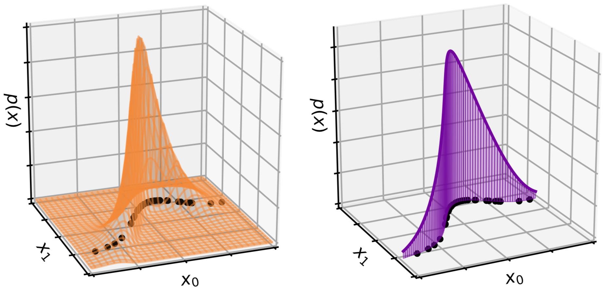

# Manifold-modeling flows

*Johann Brehmer and Kyle Cranmer 2019-2020*

In the paper [Flows for simultaneous manifold learning and density estimation](https://arxiv.org/abs/2003.13913) we introduce manifold-modeling flows (MFMFs), a new class of generative models that simultaneously learn the data manifold as well as a tractable probability density on that manifold. This repository contains our implementation of manifold-modeling flows as well as some other fow-based generative models, as well as the code for our experiments with them.

**Note that this repository is still under development and we're breaking and mending things constantly!**

## Getting started

Please make sure your Python environment satisfies the requirements in the [environment.yml](environment.yml). To use the MFMF-OT algorithm, please also follow the [installation instructions for geomloss](https://www.kernel-operations.io/geomloss/api/install.html).

## Data sets

Data set | Data dimension | Manifold dimension | Model parameters | Arguments to `generate_data.py`, `train.py`, and `evaluate.py`
--- | --- | --- | --- | ---
Gaussian on an `n`-sphere | `n` | `d` | - |  `--dataset spherical_gaussian --truelatentdim n --datadim d --epsilon eps`
Conditional Gaussian on a `n`-sphere | `n` | `d` | 2 | `--dataset conditional_spherical_gaussian --truelatentdim n --datadim d`
Mixture model on a polynomial manifold | 3 | 2 | 1 | `--dataset power`
Particle physics data (48-D) | 48 | 14 | 2 | `--dataset lhc`
Particle physics data (40-D, no angular features) | 40 | 14 | 2 | `--dataset lhc40d`
Particle physics data (2-D summary stats) | 2 | 2 | 2 | `--dataset lhc2d`

The data for the particle physics experiments is available upon request.

## Data generation

Necessary for the first three data sets in the table above. See [experiments/generate_data.py -h](experiments/generate_data.py).

## Training 

See [experiments/train.py -h](experiments/train.py). Note that the algorithms have different internal names from the acronyms in the paper:

Algorithm | Acronym in paper | Arguments to `train.py`
--- | --- | ---
Ambient flow | AF | `--algorithm flow`
Flow on manifold | FOM | `--algorithm mf --specified`
Pseudo-invertible encoder | PIE | `--algorithm pie`
Manifold-modeling flow, simultaneous training (not recommended) | MFMF-S | `--algorithm mf`
Manifold-modeling flow, alternating M/D training | MFMF-M/D | `--algorithm mf --alternate`
Manifold-modeling flow, sequential M/D training | MFMF-M/D | `--algorithm mf --sequential`
Manifold-modeling flow, Optimal Transport training | MFMF-OT | `--algorithm gamf`
Manifold-modeling flow, alternating Optimal Transport training | MFMF-OT/D | `--algorithm gamf --alternate`
Manifold-modeling flow with sep. encoder, simultaneous training (not recommended) | MFMFE-S | `--algorithm emf`
Manifold-modeling flow with sep. encoder, alternating M/D training | MFMFE-M/D | `--algorithm emf --alternate`
Manifold-modeling flow with sep. encoder, sequential M/D training | MFMFE-M/D | `--algorithm emf --sequential`

## Evaluation 

See [experiments/evaluate.py -h](experiments/evaluate.py) and the notebooks in [experiments/notebooks](experiments/notebooks). Note that the algorithms have different internal names from the acronyms in the paper:

Algorithm | Acronym in paper | Arguments to `evaluate.py`
--- | --- | ---
Ambient flow | AF | `--algorithm flow`
Flow on manifold | FOM | `--algorithm mf --specified`
Pseudo-invertible encoder | PIE | `--algorithm pie`
Manifold-modeling flow (except OT training) | MFMF | `--algorithm mf`
Manifold-modeling flow, Optimal Transport training | MFMF-OT | `--algorithm gamf`
Manifold-modeling flow with sep. encoder | MFMFE | `--algorithm emf`

## Acknowledgements

The code is largely based on the excellent [Neural Spline Flow code base](https://github.com/bayesiains/nsf) by C. Durkan, A. Bekasov, I. Murray, and G. Papamakarios, see [1906.04032](https://arxiv.org/abs/1906.04032) for their paper.
